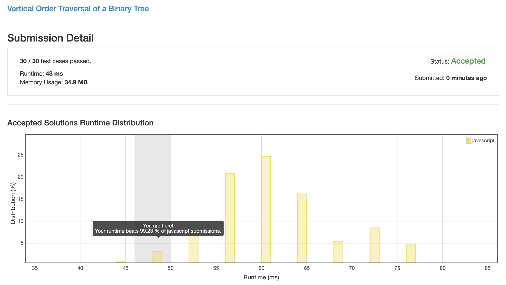

# 0987. 二叉树的垂序遍历

这个题目又需要深刻领会题意才能做出正确结果.

题目中关于 "相同位置" 的定义, 是上下左右都在同一个位置上, 也就是一个树的 `左子树的右子树` 与 `右子树的左子树` 的冲突.

而在发生这个冲突之后, 需要对这两个值进行比较, 将小的放在前面, 这个顺序只与值大小无关, 与其物理位置无关.

## 解法 1 ([traverse.js](./traverse.js))

第一点, 这个题是个遍历的题.

第二点, 这个题根据左右顺序决定前后.

第三点, 这个题根据父子关系决定上下.

为满足第一点, 我们需要使用遍历算法.

为满足第二点, 我们需要在进入 __"左右"__ 子树时使用横向偏移 (这个题目用 ±1 刚好合适).

为满足第三点, 我们需要在进入左右 __"子树"__ 时使用深度偏移 (这个题目用 +1 深度就好了).

而且为了满足上面的冲突情况要求, 需要在深度中使用数组存储数字, 以便后续处理同一深度的数字显示顺序问题.

最后将生成的三维数组 (横向 + 深度 + 冲突桶) 中的后两维拽平 (排序后 push 进结果数组), 结果就出来了.

