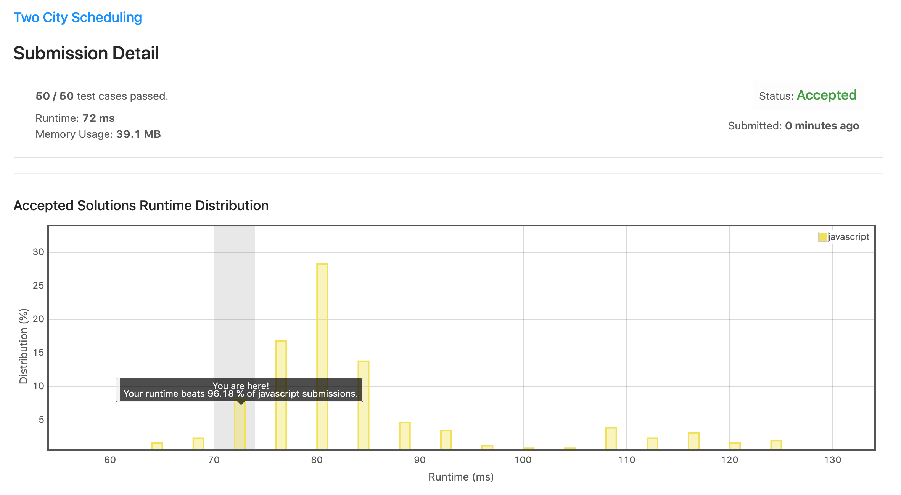

# 1029. 两地调度

## 解法 1 ([greedy.js](./greedy.js))

计算所有人去两地之间花费的差值, 排列后直接从中间分开, 各去自己更值得去的城市.


## 解法 2 ([dynamic-programming.js](./dynamic-programming.js))

根据题意, 可总结倒推规律:

```
最终结果 = min(
    最后一个人去 A 的花费 + minCost(count(B) - count(A) === 1), 
    最后一个人去 B 的花费 + minCost(count(A) - count(B) === 1)
)
```

如果不追求效率, 实际上可以用上面的方法直接递归计算了.

为了方便书写, 我们将两地命名为甲、乙, 总共有 10 个人, 分别命名为 A B C D E F G H I J.

使用表格来递归计算各种情况, 其中横轴代表去乙的人数, 纵轴代表去甲的人数, 这样右下角的单元格即为去两地人数相等时的花费之和最小值了.

以相邻的四个单元格为例:

|n-2 的最优结果|前 n-1 个人中多一个去乙的最优结果|
|---|---|
|前 n-1 个人中多一个去甲的最优结果|当前的最优结果|

进一步推理, 可得下图, 其中 0 的一行 / 列代表了 n 个人全去同一地, 没有人去另一地的情况, 因为总共只有 10 人, 所以最多只有 5 人去同一个地方, 故是一个 6x6 的表格:

|/|    0|     1|      2|       3|        4|         5|
|---|---|------|-------|--------|---------|----------|
|0|    /|     A|     AB|     ABC|     ABCD|     ABCDE|
|1|    A|    AB|    ABC|    ABCD|    ABCDE|    ABCDEF|
|2|   AB|   ABC|   ABCD|   ABCDE|   ABCDEF|   ABCDEFG|
|3|  ABC|  ABCD|  ABCDE|  ABCEDF|  ABCDEFG|  ABCDEFGH|
|4| ABCD| ABCDE| ABCDEF| ABCDEFG| ABCDEFGH| ABCDEFGHI|
|5|ABCDE|ABCEDF|ABCDEFG|ABCDEFGH|ABCDEFGHI|ABCDEFGHIJ|


