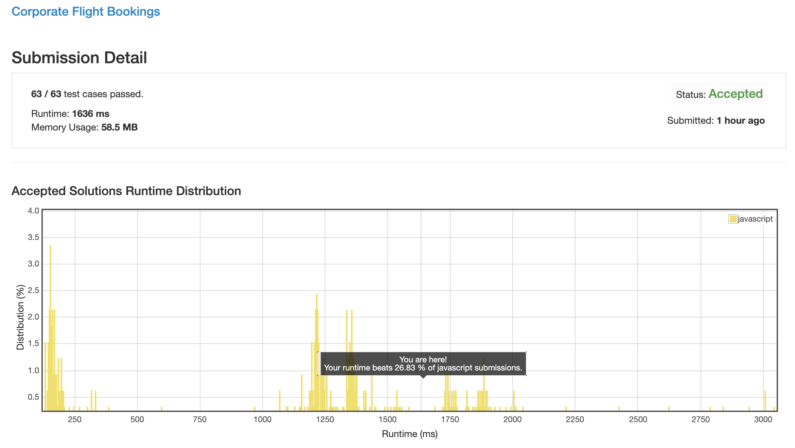
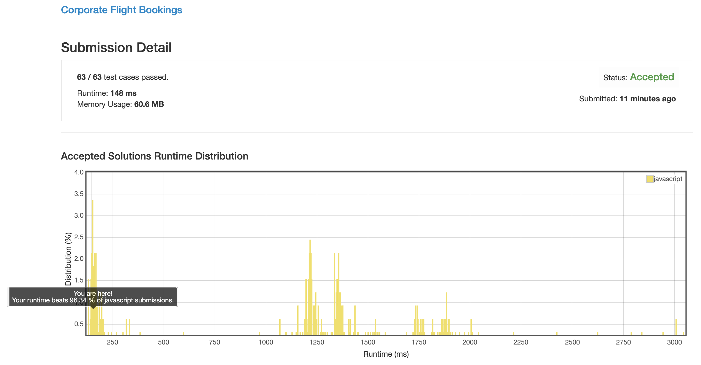

# 1109. 航班预订统计

## 解法 1 ([noob.js](./noob.js))

非常暴力的解法, 直接生成一个结果数组, 然后遍历预订, 根据每个预订的 case 往指定位置上加数字.

## 解法 2 ([mark.js](./mark.js))

上一个解法中, 时间复杂度比较高的原因主要就是每个 case 都会去遍历一整次区间内所有 case, 时间复杂度非常高.

这里将这个位置简化, 做成标志位, 搞一个标志数组, case 开始位置 +num, 结束位置 -num.

最后生成结果数组的时候, 搞个游标, 遇到每个标志位就加减对应的数量, 并将当前值赋值给结果数组的当前位置.

### 优化点

在其它条件都无法优化时, 可以试试 `Uint8Array` 一类的预置数组, 有奇效.

