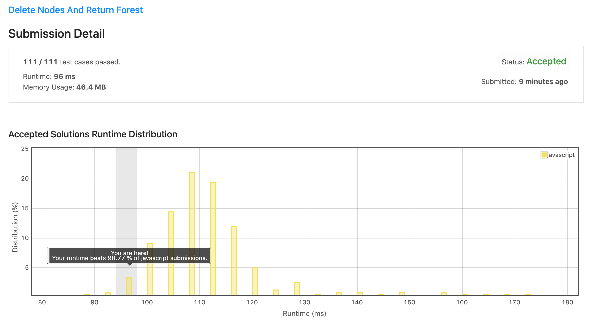

# 1110. 删除节点并返回剩余森林

## 解法 1 ([dfs.js](./dfs.js))

核心思路: 遍历全树, 并将被移除节点的子节点加入结果列表中.

### 优化点

1. ES6 Set, 非常有用, 性能较 `Array.prototype.include` 大大提升.

1. 通过传递标志位及读取返回值并赋值到对应位置, 将单节点操作内聚, 减少上下文关联.

1. 根据判断条件及早将不同代码分支, 减少逻辑内部判断语句执行数量.

#### 思路来源

+ [https://leetcode.com/problems/delete-nodes-and-return-forest/discuss/328853/JavaC%2B%2BPython-Recursion-Solution](https://leetcode.com/problems/delete-nodes-and-return-forest/discuss/328853/JavaC%2B%2BPython-Recursion-Solution)

+ [https://leetcode.com/problems/delete-nodes-and-return-forest/discuss/328854/Python-Recursion-with-explanation-Question-seen-in-a-2016-interview](https://leetcode.com/problems/delete-nodes-and-return-forest/discuss/328854/Python-Recursion-with-explanation-Question-seen-in-a-2016-interview)

