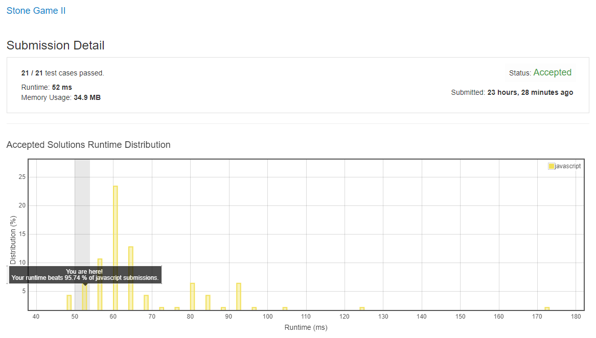

# 1140. 石子游戏 2

这题真的挺难的, 我独立思考没做出来, 看答案理解的.

## 解法 1 ([dynamic-programming.js](./dynamic-programming.js))

题目要求的结果是 “你” 最多能拿多少.

根据题意, 这里 “你” 能拿多少也取决于对手能拿多少, 而且对手也是一个 “人”, 并不会故意让你.

拿石头的顺序就是:

```
对 n 次 (如果存在的话) + 我 n 次 + 对 n-1 次 + 我 n-1 次 + 对 n-2 次 + 我 n-2 次 + ... + 对 1 次 + 我 1 次
```

按照 DP 的思路, 应该从结果开始倒推 (对方拿最少 === 我方拿最多) (一定要倒推, 倒推是 DP, 正推是贪心):

```
min(min(min(min(min(对 n 次) + 我 n 次 + 对 n-1 次) + 我 n-1 次) + 对 n-2 次) + 我 n-2 次 + ... + 对 1 次) + 我 1 次
```

千言万语汇成一句话:

```
max(me) = min(you)
```

而 `min(x) = Math.min(fn(remain, pick_m1), fn(remain - 1, pick_m2), fn(remain - 2, pick_m3), ...)`.

也就是说 min 就是把所有可能性都遍历一遍, 求其中最小值.

而因为 m 是由曾经 pick x 的最大值来确定的, 所以 `remain` 和 `m` 的值的关系是多对多关系, 并不一一对应.

但这个值是永远不会变的, 所以可以用矩阵来保存计算结果加速计算.



~~所以如果我方想要拿最多, 题目就可以分解为:~~

~~对手拿最少的情况(对手拿最少的情况(... + 我拿第 3 次 + 对手拿第 2 次) + 我拿第 2 次 + 对手拿第 1 次) + 我拿第 1 次~~

~~两方的目标相同, 所以在求每次单方拿石头数量时, 要用相同的策略.~~

~~也就是说, 虽然做到了每次对手拿最少, 但对手也是做到了在这种最劣情况下的最优解 (即我们只构造最劣情况, 无法控制对方拿法).~~

~~题目规定我方先行也是为了让算法能够顺利地执行 (因为对方先行的话, 可能性会多一些, 导致后面不好收拢).~~

~~而此题目中存在两维的变量, 即 `目前位置 i` 与 `目前 M 值`.~~

~~所以 DP 表也要建成二维的, 含义为: 当推进到 i 位, M 值为 `?` 的时候, (无论是谁) 可以取到的最大石头数量是 `value`.~~

~~按我们上面的公式来看, 该值是递归倒推的~~