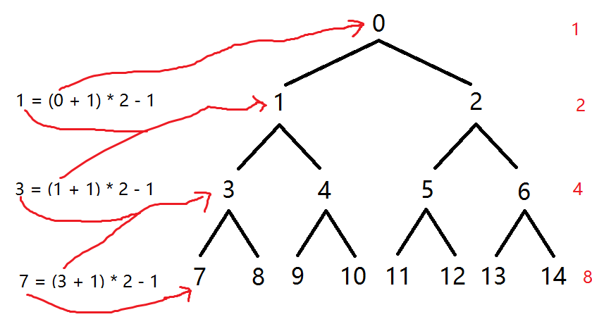

堆排序
===

+ 稳定性

    不稳定（树结构形成时的形态可能会让后方元素出现在前面） 

+ 复杂度

    - 时间复杂度

        非常稳定，永远 O(n(log n))

    - 空间复杂度

        O(1)

+ 原理

    将前 n 个数字搞成一个大（小）堆，然后把最大的数移到最后，继续整理前 n - 1 个数，不断整理。

    注意：开始的时候要从后往前倒序初始化一次堆才行。

    
